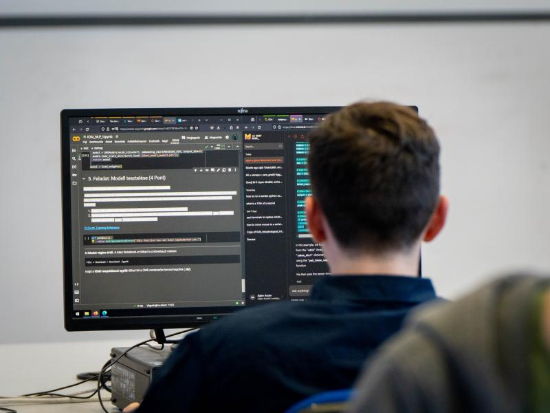

# <u>International Olympiad in Artificial Intelligence (IOAI) 2024</u>

As a first-time mentor in the 2024 AI Olympiad held in Burgas, Bulgaria, I gained invaluable insights into teaching high school students and organizing large-scale events. As part of the organizational team, I learned the crucial steps involved in coordinating a national qualifier event for Hungary and Erdély in Romania. I am thrilled to have been part of this experience and look forward to participating again next year.

## <u>The Olympiad</u>

The International Science Olympiads are a group of worldwide annual competitions in various areas of the formal sciences, natural sciences, and social sciences. The competitions are designed for the 4-6 best high school students from each participating country.

Some of the most famous ISOs include the International Mathematical Olympiad (IMO) and the International Olympiad in Informatics (IOI). The aims of each ISO are to promote a career in science and to challenge the brightest students from around the world. For further details, refer to the organizer's website: [[IOAI 2024]](https://ioai-official.org/what-is-ioai/)

## <u>Talent Sourcing</u>

Our inaugural talent sourcing initiative involved distributing a One Pager across schools in Hungary to promote our event and the upcoming qualifier round. This document included contact details and information on the multidisciplinary knowledge needed for preparation. We reached 80 students with our survey, of whom 74 actively participated in the qualifier. Notably, 6 participants were from Erdély’s Márton Áron High School in Csíkszereda, marking a significant success for our outreach efforts.

## <u>National Qualifier</u>

For the qualifier round, I designed a variety of competition exercises, including scientific tasks related to ChatGPT and Neural Playground. The exercises featured three Computer Vision (CV) challenges where students either utilized an open-source CV OCR tool or developed a neural network architecture for classification tasks.

In addition, I crafted exercises in Natural Language Processing (NLP) that covered Machine Translation and fundamental NLP tasks such as lemmatization, tokenization, chunking, RNNs, Encoders, Decoders, and Transformers. These exercises were designed to be accessible and engaging for high school students, avoiding the complexity typically found at the university level.

For the final exercise, I created a comprehensive questionnaire with 40 questions focused on gradient-based learning and PyTorch. On average, students completed about 40% of my notebooks, achieved roughly 70% on the questionnaires, and scored around 90% on the scientific exercises.

*Photo: Vincze Dorottya (ELTE).*

[[News Article]](https://njszt.hu/hu/news/2024-06-12/nyilvanosak-nemzetkozi-mesterseges-intelligencia-diakolimpia-ioai-valogatojanak)[[National Qualifier Exercises]](https://drive.google.com/drive/folders/1Kppc-FbmO35yqUTrkS4_v1GOXb_GLcA3?usp=sharing)

## <u>Summer Camp</u>

Due to a severe illness and fever, I was unfortunately unable to attend the 2024 National Summer Camp for IOAI, which we hosted for our two selected teams comprising eight exceptional high school students. The camp's objective was to assist the students with their Take Home questions and prepare them for the upcoming international competition.

## <u>International Event: WE'VE WON SECOND PLACE!</u>

Unfortunately, due to a  scheduling conflict with my summer holiday, I was unable to attend the international event in Burgas as a mentor in 2024. Our two teams achieved an impressive second place, putting in a tremendous effort that earned them a special award for exceptional performance in both the scientific and practical rounds. You can read more about the event in Hungarian media.

*Photo: IOAI Organizing Team.*

[[Telex]](https://telex.hu/techtud/2024/08/15/diakolimpia-mesterseges-intelligencia-ezusterem-bronzerem-bulgaria)[[NJSZT]](https://njszt.hu/hu/news/2024-08-15/osszetett-harmadik-helyezes-az-elso-nemzetkozi-mesterseges-intelligencia)

Next year's event will be hosted in Beijing, China, and I'm very excited about it.