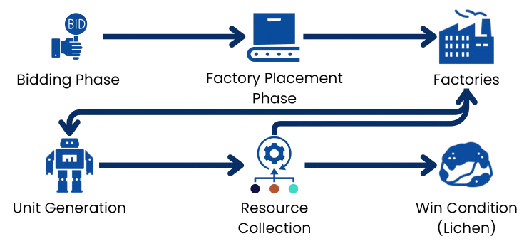
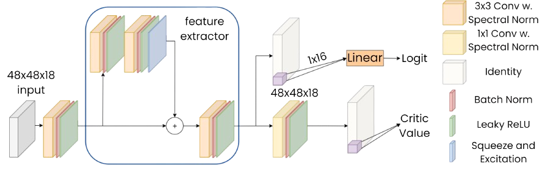
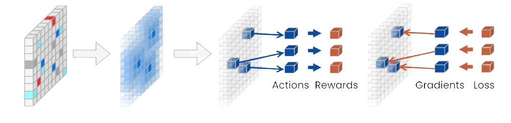
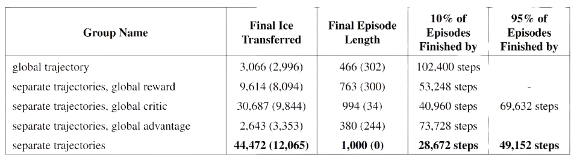

# <u>Scalable Reinforcement Learning in Multi-Agent Environments</u>

  Tamás Takács1,
  Gergely Magyar1,
  &
  László Gulyás2

  1 <em>MSc Students @ ELTE, Department of Artificial Intelligence</em>

  2 <em>Associate Professor @ ELTE, Department of Artificial Intelligence</em>

  <u><a class="font-bold" href="/" title="Paper Link" target="_blank">[Paper]</a></u>
  
  <u><a class="font-bold" href="https://github.com/MagmaMultiAgent/MagMA" title="Code Link" target="_blank">[Code]</a></u>
  
  <u><a class="font-bold" href="/projects/MagMA.pdf" title="Poster Link" target="_blank">[Poster]</a></u>

## <u>Abstract</u>

Novel reinforcement learning algorithms often face scalability and compatibility issues in multi-agent environments due to their optimization for single-agent settings. The lack of standardized methods for adaptation restricts their broader applicability, especially when dealing with rapidly changing numbers of controllable entities and massive scaling. Challenges include credit assignment, extensive memory usage, and increased computational time, leading to slow, destabilized training and suboptimal resource utilization. We propose a hybrid architecture, combining monolithic and distributed approaches, resulting in a 30-times reduction in model size and  learning basic skills 24 times faster with 600-times fewer training examples compared to related works in the same environment. We also introduce  trajectory separation, achieving a 3-times speed increase  in training convergence. Our M-PPO-based  hybrid model achieves:

* a performance-based environment
* separated agent trajectories
* separated reward, advantage, probability and entropy calculation
* reinforced positive behavior in early training

*Figure 2: Me performing at a poster exhibition on a three day Machine Learning Conference in Budapest, Hungary (Magyar Machine learning Találkozó). The event was hosted by [[HUN-REN]](https://hun-ren.hu/) in collaboration with  [[SZTAKI]](https://sztaki.hun-ren.hu/).*

## <u>Introduction</u>

A MARL solution can be conceptualized along a spectrum of organizational paradigms [[Piccoli 2023]](https://arxiv.org/pdf/2302.12308). At one end of the spectrum, the single-brain approach centralizes decision-making, where a collective of agents is treated as a single entity. In this model, a global observation is used to generate a unified trajectory, and rewards are distributed based on collective outcomes, which can inadvertently reinforce negative behaviors. In contrast, a hybrid model utilizes local information from all agents to generate a single trajectory but incorporates a global reward system.

Our research improves on this hybrid model by  allocating rewards to individual agents or groups based on their specific contributions, thus creating a performance-based environment that operates at the individual or small group level. This approach involves dividing the environment's trajectories among agents or groups, allowing for the calculation of rewards, log probabilities, value estimates, advantages, and entropy for each unit or group. This method  bootstraps the learning process by ensuring that rewards only reinforce positive behaviors early on. At the other end of the spectrum is the fully multi-agent approach, where each entity interacting with the environment is treated as an independent learning agent. This significantly complicates the learning process by creating trajectories of varied lengths, as entities may enter or exit the scene, or be destroyed. Consequently, gathering a consistent amount of experience for each entity becomes challenging, especially when some entities may only exist in the environment for a fraction of the time compared to others. This situation leads to computational inefficiencies and data sparsity. Our solution effectively addresses these challenges by offering a framework that  mitigates the issues associated with both the single-brain and fully multi-agent approaches. Our research also focuses on evaluating these methodologies in dynamically changing environments and offers insights into addressing computational and emergent intelligence challenges without heavy reliance on domain-specific constraints or rigid rules.

## <u>Environment</u>

The Lux AI Environment represents a 2D grid platform tailored for Multi-Agent Reinforcement Learning (MARL) research [[Chen et al. 2023]](https://arxiv.org/abs/2301.01609), designed to tackle challenges in multi-variable optimization, resource acquisition, and allocation within a competitive 1v1 setting. Beyond optimization, proficient agents are tasked with adeptly analyzing their adversaries and formulating strategic policies to gain a decisive advantage. The environment is fully observed by all agents. For further information on the environment, visit the official competition documentation [[Tao, Pan, et al. 2023a]](https://www.kaggle.com/competitions/lux-ai-season-2).

*Figure 1: A visual representation of the grid environment, generated from a specific seed.*

*Figure 2: Simplified environment loop of the Lux AI Environment. An episode starts with the Bidding Phase and ends after 1000 steps. The player with the most lichen collected wins.*

## <u>What is Trajectory Separation?</u>

Trajectory separation is a technique used to improve credit assignment in multi-agent environments by tracking rewards, critic values, actions, and entropies separately for each entity or group of entities. Instead of aggregating rewards into a single global value, it breaks down each environment step into multiple distinct training examples. This approach allows for more precise attribution of rewards to specific actions, reducing the risk of skewed reward attribution that can occur when dealing with many entities. As a result, it enhances the accuracy of backpropagation, reinforcing beneficial behaviors and correcting detrimental ones more effectively.

*Figure 3:  Showing the difference between global rewards (left) and rewards distributed into groups using trajectory separation (right).*

*Figure 4:   Demonstrating policy loss calculation with the extended dimension. The matrices on the image represent a mini-batch consisting of 3 environment steps. Inactive groups are marked.*

## <u>Global Feature Extractor</u>

We developed a global feature extractor to learn a comprehensive mapping from environmental states to actions. This approach allows us to capture a unified behavior pattern, enhanced by the individual actions of agents, thereby achieving emergent collaborative intelligence.

*Figure 5:  The structure of the final feature extractor and the critic and actor heads utilized on top of M-PPO.*

*Figure 6:  Our novel trajectory separation method achieves distributed rewards by producing one trajectory per entity or cluster and calculating loss based on individual performance.*

## <u>Results</u>

In our study, we compared our results with other competition submissions, conducted experiments on various credit assignment setups, and performed ablation studies.

*Figure 7:  Results demonstrate the effectiveness of trajectory separation, revealing that higher agent-specific reward weights heavily improve performance. Episode Length indicates team survival duration, while Ice Transferred and Average Factory Alive reflect resource collection efficiency.*

*Figure 8:  Table comparing the removal of separated components relevant to the advantage calculation. The metrics featured include the amount of ice transferred by units and the length of the episodes
in the evaluation phase following the last training cycle. The table also contains the observed environment steps needed until the model reaches the maximum episode length in the specified percentage of
evaluation environments. In addition to the test variants, the global and completely separate trajectory
variants are also present. Removing the separation of rewards and critic values caused a significant
performance decrease. Reward appears to be the most important component.*

## <u>Citation</u>

Read the full paper for more details: <u><a class="font-bold" href="/" title="Paper Link" target="_blank">[Paper]</a></u>, and if you find this work informative please consider citing it:

<pre style="background-color: #2e2e2e; color: #ffffff; padding: 15px; border-radius: 5px; overflow-x: hidden; font-family: monospace; white-space: pre-wrap; word-wrap: break-word;">
  <code style="color: white; letter-spacing: 1px;">
@article{getlar2024,
  soon...
}
  </code>
</pre>

